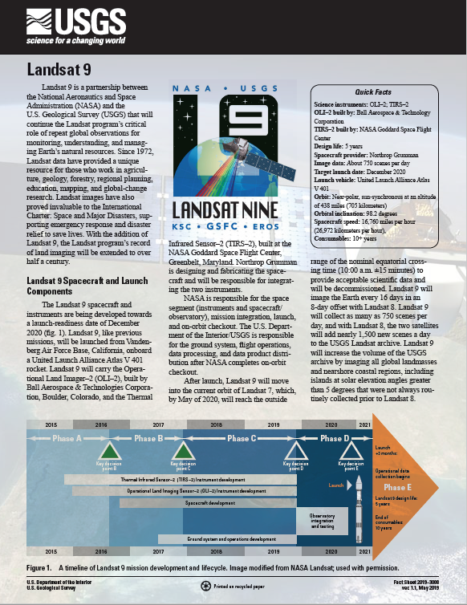

```{r setup, include=FALSE,echo=FALSE}
options(htmltools.dir.version = FALSE)
library(dplyr)
library(readr)
library(readxl)
library(knitr)
```

```{r xaringan-themer, include=FALSE, warning=FALSE}
library(xaringanthemer)
style_duo_accent(primary_color = "#0D5E74", 
                 # secondary_color = "#2881C6",
  header_font_google = google_font("Josefin Sans"),
  text_font_google   = google_font("Montserrat", "300", "300i"),
  code_font_google   = google_font("Fira Mono"),
)
```

```{r xaringan-all, echo=FALSE, warning=FALSE}
library(countdown)
library(xaringan)
library(xaringanExtra)
hook_source <- knitr::knit_hooks$get('source')
knitr::knit_hooks$set(source = function(x, options) {
  x <- stringr::str_replace(x, "^[[:blank:]]?([^*].+?)[[:blank:]]*#<<[[:blank:]]*$", "*\\1")
  hook_source(x, options)
})
xaringanExtra::use_broadcast()
xaringanExtra::use_freezeframe()
xaringanExtra::use_scribble()
#xaringanExtra::use_slide_tone()
xaringanExtra::use_search(show_icon = TRUE, auto_search	=FALSE)
xaringanExtra::use_freezeframe()
xaringanExtra::use_clipboard()
xaringanExtra::use_tile_view()
xaringanExtra::use_panelset()
xaringanExtra::use_editable(expires = 1)
xaringanExtra::use_fit_screen()
xaringanExtra::use_extra_styles(
  hover_code_line = TRUE,         
  mute_unhighlighted_code = TRUE  
)
```

```{r setupbibliography, include=FALSE}
# Code supplied by Andy (see wk2 slides 25-28)
library(RefManageR)
library(knitcitations)
BibOptions(check.entries = FALSE,
           bib.style = "authoryear",
           cite.style = "authoryear",
           style = "markdown",
           hyperlink = TRUE,
           dashed = FALSE,
           no.print.fields=c("doi", "url", "urldate", "issn"))
myBib <- ReadBib("references.bib",
                 # "./Bib.bib", 
                 check = FALSE)
```

class: center, title-slide, middle

background-image: url("https://th.bing.com/th/id/OIP.bymqEIDKbTreoK_4_0JyzgHaEK?rs=1&pid=ImgDetMain")
background-size: cover
background-position: center

</br>
# Landsat 9
</br></br></br>
## A new milestone for Earth observation
</br> </br>
### Xiaoyi Chen, CASA, UCL
### `r format(Sys.time(), "%d/%m/%Y")`

---

--- 
```{css, echo=FALSE}
/* 自定义CSS样式 */

/* 设置图片大小 */
img {
  max-width: 50%; /* 设置图片最大宽度为幻灯片宽度的50% */
  height: auto; /* 保持宽高比例 */
}
```

## 1 Introduction to Landsat 9
### 1.1 Landsat9 Overview

```{r eval=FALSE, fig.align='center', include=FALSE, out.height='200%'}
l9_path="https://landsat.gsfc.nasa.gov/wp-content/uploads/2020-07/Landsat_timeline_20200318_title.gif"
knitr::include_graphics(l9_path)
```

```{r echo=FALSE, out.height='200%', fig.align='center', fig.cap='Timeline of the Landsat program'}
l9_path="https://landsat.gsfc.nasa.gov/wp-content/uploads/2020-07/Landsat_timeline_20200318_title.gif"
knitr::include_graphics(l9_path)
```

<div class="justify-text">
Landsat 9, launched in September 27, 2021, is a collaborative satellite mission between NASA and the U.S. Geological Survey (USGS). It serves as a continuation of the Landsat program's legacy in Earth observation.
</div>
</br>
source:[NASA](https://landsat.gsfc.nasa.gov/satellites/timeline/)

---
## 1 Introduction to Landsat 9

### 1.2 Mission Objectives
<div style="display: flex; justify-content: space-around; align-items: flex-start; text-align: right;">
  <figure style="margin: 0 5px; flex-basis: calc(50% - 10px);">
    <figcaption style="font-size: 18px; text-align: middle;">
      <ul style="list-style-type: disc; padding-left: 0; margin: 10px 0; text-align: left;">
        <li style="font-size: 18px;">The primary objectives of Landsat 9 include continuous monitoring of the Earth's surface, providing high-resolution Earth imaging data, and supporting various scientific research and applications such as land use monitoring, agriculture, forestry, urban planning, and environmental management.</li>
      </ul>
    </figcaption>
  </figure>

  <figure style="margin: 0 5px; flex-basis: calc(65% - 2px);">
    
  </figure>
</div>

Landsat 9 Mission Logo: [View Media Details](https://www.usgs.gov/landsat-missions/landsat-9#:~:text=Landsat%209%20is%20a%20partnership%20between%20the%20U.S.,for%20monitoring%2C%20understanding%2C%20and%20manag%C2%ADing%20Earth%E2%80%99s%20natural%20resources.)

---
### 1.2 Mission Objectives:

<div class="custom-page">
.pull-left[
    
The primary objectives of Landsat 9 include continuous monitoring of the Earth's surface, providing high-resolution Earth imaging data, and supporting various scientific research and applications such as land use monitoring, agriculture, forestry, urban planning, and environmental management.

]

.pull-right[
```{r echo=FALSE, out.width='300%', fig.align='right'}

```
]

</div>
Landsat 9 Mission Logo: [View Media Details](https://www.usgs.gov/landsat-missions/landsat-9#:~:text=Landsat%209%20is%20a%20partnership%20between%20the%20U.S.,for%20monitoring%2C%20understanding%2C%20and%20manag%C2%ADing%20Earth%E2%80%99s%20natural%20resources.)


---
## 2 Landsat 9 Instruments


**Operational Land Imager 2 (OLI-2):**
OLI-2 is an advanced imaging instrument carried by Landsat 9, featuring high resolution and multi-band observation capabilities. It captures spectral characteristics of the Earth's surface, aiding in land surface identification and monitoring.

**Thermal Infrared Sensor 2 (TIRS-2):**
TIRS-2 is another crucial sensor specialized in measuring thermal infrared radiation from the Earth's surface. Landsat 9 utilizes TIRS-2 to acquire surface temperature data, providing valuable insights into climate change, land surface heat characteristics, etc.


```{r echo=FALSE, out.width='150%', fig.align='center'}
oli_tir="https://d9-wret.s3.us-west-2.amazonaws.com/assets/palladium/production/s3fs-public/thumbnails/image/OLI2-TIRS-2.PNG"
knitr::include_graphics(oli_tir)
```
[](https://www.gov.uk/government/news/environment-agency-working-day-and-night-to-reduce-flood-impact--2)


---
## 3 Significance of the Landsat 9 Mission

Importance of Earth Observation and Environmental Monitoring:
The Landsat 9 mission is significant in continuously monitoring changes on Earth's surface, aiding scientists and decision-makers in understanding Earth system dynamics, environmental protection, resource management, and climate change adaptation.


---
## 3 Significance of the Landsat 9 Mission


Role of Data in Scientific Research and Applications:
Data from Landsat 9 plays a crucial role in various scientific research and applications, supporting activities such as land use monitoring, agricultural production optimization, urban planning, and environmental protection.

---
## 4 Scientific Applications of Landsat 9

```{r xaringan-panelset-1, echo=FALSE}
xaringanExtra::use_panelset()
```

.panelset[

.panel[.panel-name[Land Use Monitoring]

Landsat 9 data can be utilized for monitoring land use and cover changes, including agricultural expansion, urbanization, forest changes, etc., providing essential insights for land resource management and planning.

- **1.29 million** people were affected, with **33 dead and 18 missing**

- **59,000** houses collapse and **147,000 houses** seriously damaged

- Crops affected about **225,000 acres**


source: [Voanews](https://www.voanews.com/a/floods-strike-blow-to-china-s-faltering-economy-/7221953.html), [Reuters](https://www.reuters.com/world/china/china-floods-hit-rice-corn-crops-trigger-food-inflation-worries-2023-08-11/)
]


.panel[.panel-name[Agriculture and Forestry]

Agricultural and forestry managers can leverage Landsat 9 data to monitor crop growth conditions, forest cover changes, etc., optimizing agricultural production and forest resource management.


source: [Scmp](https://www.scmp.com/economy/china-economy/article/3143212/china-floods-economic-damage-livestock-industry-tops-us348), [Reuters](https://www.reuters.com/world/china/china-floods-hit-rice-corn-crops-trigger-food-inflation-worries-2023-08-11/)
]


.panel[.panel-name[Urban Planning]

Landsat 9 data supports urban planning and development monitoring, including urban expansion, land use structure changes, etc., providing valuable information for urban planners and policymakers.


source: [Reuters](https://www.reuters.com/world/china/china-floods-hit-rice-corn-crops-trigger-food-inflation-worries-2023-08-11/)]


.panel[.panel-name[Environmental Management]

Landsat 9 data is crucial for environmental monitoring, natural resource conservation, and ecosystem management, facilitating the identification of ecologically sensitive areas, pollution monitoring, etc.

source: [Reuters](https://www.reuters.com/world/china/china-floods-hit-rice-corn-crops-trigger-food-inflation-worries-2023-08-11/)]

]


---
## 5 Data Distribution and Utilization of Landsat 9

Data Acquisition and Processing:
Landsat 9 data can be obtained through various channels, including NASA and USGS official websites, data archives, etc. Additionally, various data processing tools and software are available for data analysis and processing.

User Support and Services:
NASA and USGS provide various support and services for users, including data query, technical support, training, and educational resources, facilitating users in effectively utilizing Landsat 9 data.

Data Application Examples:
Landsat 9 data has widespread application examples across various fields, including land use monitoring, agricultural production, urban planning, environmental protection, etc.


---
## 6 Future Outlook

Role and Impact of Landsat 9:
Landsat 9 will continue to play a significant role in Earth observation, providing data support and technical assistance for scientific research, resource management, and environmental protection.

Trends in Earth Observation Technology Development:
With continuous technological advancements, Earth observation technology is expected to evolve, potentially introducing more advanced sensors and technologies, leading to breakthroughs in Earth science research.


---
## Reference
<small>

- NASA (2024) _Landsat Program: 50 Years of Earth Observations_. Available at: https://landsat.gsfc.nasa.gov/satellites/timeline/ (Accessed: 5 July 2024).


