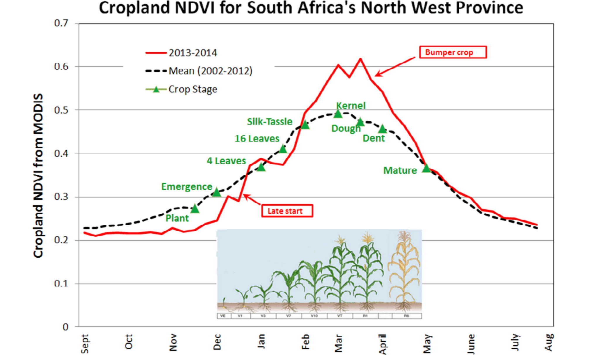

```{r setup, include=FALSE,echo=FALSE}
options(htmltools.dir.version = FALSE)
library(dplyr)
library(readr)
library(readxl)
library(knitr)
```

```{r xaringan-themer, include=FALSE, warning=FALSE}
library(xaringanthemer)
style_duo_accent(primary_color = "#0D5E74", 
                 # secondary_color = "#2881C6",
  header_font_google = google_font("Josefin Sans"),
  text_font_google   = google_font("Montserrat", "300", "300i"),
  code_font_google   = google_font("Fira Mono"),
)
```

```{r xaringan-all, echo=FALSE, warning=FALSE}
library(countdown)
library(xaringan)
library(xaringanExtra)
hook_source <- knitr::knit_hooks$get('source')
knitr::knit_hooks$set(source = function(x, options) {
  x <- stringr::str_replace(x, "^[[:blank:]]?([^*].+?)[[:blank:]]*#<<[[:blank:]]*$", "*\\1")
  hook_source(x, options)
})
xaringanExtra::use_broadcast()
xaringanExtra::use_freezeframe()
xaringanExtra::use_scribble()
#xaringanExtra::use_slide_tone()
xaringanExtra::use_search(show_icon = TRUE, auto_search	=FALSE)
xaringanExtra::use_freezeframe()
xaringanExtra::use_clipboard()
xaringanExtra::use_tile_view()
xaringanExtra::use_panelset()
xaringanExtra::use_editable(expires = 1)
xaringanExtra::use_fit_screen()
xaringanExtra::use_extra_styles(
  hover_code_line = TRUE,         
  mute_unhighlighted_code = TRUE  
)
```

```{r setupbibliography, include=FALSE}
# Code supplied by Andy (see wk2 slides 25-28)
library(RefManageR)
library(knitcitations)
BibOptions(check.entries = FALSE,
           bib.style = "authoryear",
           cite.style = "authoryear",
           style = "markdown",
           hyperlink = TRUE,
           dashed = FALSE,
           no.print.fields=c("doi", "url", "urldate", "issn"))
myBib <- ReadBib("references.bib",
                 # "./Bib.bib", 
                 check = FALSE)
```

class: center, title-slide, middle

background-image: url("https://th.bing.com/th/id/OIP.bymqEIDKbTreoK_4_0JyzgHaEK?rs=1&pid=ImgDetMain")
background-size: cover
background-position: center

</br>
# Landsat 9
</br></br></br>
## A new milestone for Earth observation
</br> </br>
### Xiaoyi Chen, CASA, UCL
### `r format(Sys.time(), "%d/%m/%Y")`

---

--- 
```{css, echo=FALSE}
/* 自定义CSS样式 */

/* 设置图片大小 */
img {
  max-width: 50%; /* 设置图片最大宽度为幻灯片宽度的50% */
  height: auto; /* 保持宽高比例 */
}
```

## 1 Introduction to Landsat 9
### 1.1 Landsat9 Overview

```{r eval=FALSE, fig.align='center', include=FALSE, out.height='200%'}
l9_path="https://landsat.gsfc.nasa.gov/wp-content/uploads/2020-07/Landsat_timeline_20200318_title.gif"
knitr::include_graphics(l9_path)
```

```{r echo=FALSE, out.height='200%', fig.align='center', fig.cap='Timeline of the Landsat program'}
l9_path="https://landsat.gsfc.nasa.gov/wp-content/uploads/2020-07/Landsat_timeline_20200318_title.gif"
knitr::include_graphics(l9_path)
```

<div class="justify-text">
Landsat 9, launched in September 27, 2021, is a collaborative satellite mission between NASA and the U.S. Geological Survey (USGS). It serves as a continuation of the Landsat program's legacy in Earth observation.
</div>
</br>
source:[NASA](https://landsat.gsfc.nasa.gov/satellites/timeline/)

---
## 1 Introduction to Landsat 9

### 1.2 Mission Objectives

.pull-left[
The primary objectives of Landsat 9 include continuous monitoring of the Earth's surface, providing high-resolution Earth imaging data, and supporting various scientific research and applications such as land use monitoring, agriculture, forestry, urban planning, and environmental management.
]

.pull-right[

```{r echo=FALSE, out.width='150%', fig.align='center'}
knitr::include_graphics("https://d9-wret.s3.us-west-2.amazonaws.com/assets/palladium/production/s3fs-public/styles/side_image/public/thumbnails/image/Landsat9factsheet.PNG?itok=niZM7Pw7")
```
```{r eval=FALSE, fig.align='center', include=FALSE, out.width='150%'}
knitr::include_graphics("./images/Landsat9factsheet.png")
```
]


Landsat 9 Mission Logo: [View Media Details](https://www.usgs.gov/landsat-missions/landsat-9#:~:text=Landsat%209%20is%20a%20partnership%20between%20the%20U.S.,for%20monitoring%2C%20understanding%2C%20and%20manag%C2%ADing%20Earth%E2%80%99s%20natural%20resources.)


---
## 2 Landsat 9 Instruments

<div class="justify-text">
The satellite carries two science instruments, the Operational Land Imager 2 (OLI-2) and the Thermal Infrared Sensor 2 (TIRS-2). 
</div>

**Operational Land Imager 2 (OLI-2):**
OLI-2 is an advanced imaging instrument carried by Landsat 9, featuring high resolution and multi-band observation capabilities. It captures spectral characteristics of the Earth's surface, aiding in land surface identification and monitoring.

**Thermal Infrared Sensor 2 (TIRS-2):**
TIRS-2 is another crucial sensor specialized in measuring thermal infrared radiation from the Earth's surface. Landsat 9 utilizes TIRS-2 to acquire surface temperature data, providing valuable insights into climate change, land surface heat characteristics, etc.


```{r echo=FALSE, out.width='150%', fig.align='center'}
oli_tir="https://d9-wret.s3.us-west-2.amazonaws.com/assets/palladium/production/s3fs-public/thumbnails/image/OLI2-TIRS-2.PNG"
knitr::include_graphics(oli_tir)
```
source:[source](https://www.gov.uk/government/news/environment-agency-working-day-and-night-to-reduce-flood-impact--2)

---
## 2 Landsat 9 Instruments


<div style="font-size: 80%; width: 80%; margin: auto;">


| Band | Description               | Wavelength (µm)        | Resolution (m) |
|------|---------------------------|------------------------|----------------|
| 1    | Visible Coastal Aerosol   | 0.43 - 0.45            | 30             |
| 2    | Visible Blue              | 0.450 - 0.51           | 30             |
| 3    | Visible Green             | 0.53 - 0.59            | 30             |
| 4    | Red                       | 0.64 - 0.67            | 30             |
| 5    | Near-Infrared             | 0.85 - 0.88            | 30             |
| 6    | SWIR 1                    | 1.57 - 1.65            | 30             |
| 7    | SWIR 2                    | 2.11 - 2.29            | 30             |
| 8    | Panchromatic (PAN)        | 0.50 - 0.68            | 15             |
| 9    | Cirrus                    | 1.36 - 1.38            | 30             |
| 10   | TIRS 1                    | 10.6 - 11.19           | 100            |
| 11   | TIRS 2                    | 11.5 - 12.51           | 100            |

</div>
The tables above list the spectral bands of the Operational Land Imager 2 (OLI-2) and the Thermal Infrared Sensor 2 (TIRS-2) on Landsat 9, detailing their respective wavelengths and resolutions.
</br></br>
source:[USGS Technical Announcement (February 2022)](https://www.usgs.gov/landsat-missions/landsat-9#:~:text=Landsat%209%20is%20a%20partnership%20between%20the%20U.S.,for%20monitoring%2C%20understanding%2C%20and%20manag%C2%ADing%20Earth%E2%80%99s%20natural%20resources.)

---
## 3 Significance of the Landsat 9


1. **Observational Continuity**: Landsat 9 extends our ability to measure changes on a global scale, allowing us to differentiate between human-induced and natural changes. This continuity is essential for informed land use decisions.

2. **Improved Instruments**: Landsat 9 carries two science instruments:
   - **OLI-2**: Captures observations in visible, near-infrared, and shortwave-infrared light.
   - **TIRS-2**: Measures thermal infrared radiation (heat) from Earth's surfaces, improving upon Landsat 8's TIRS instrument.

3. **Temporal Coverage**: Landsat 9's orbit is eight days out of phase with Landsat 8, providing more frequent observations. Applications like tropical deforestation alerts, water quality monitoring, and crop condition reports benefit from this increased temporal coverage.

4. **Global Constellation**: Landsat has become a cornerstone of the global constellation of imagers. Its science quality and careful calibration make it a "gold standard" for harmonizing multiple sources of satellite imagery.

source:[Landsat 9 Mission Details](https://landsat.gsfc.nasa.gov/satellites/landsat-9/landsat-9-mission-details/)


---
## 4 Scientific Applications of Landsat 9

<div style="display: flex; justify-content: space-around; align-items: flex-start; text-align: middle;">
  <figure style="margin: 0 5px; flex-basis: calc(31.3% - 2px);">
    
    <figcaption style="font-size: 18px; text-align: left;">
      <strong>Agriculture and Forestry</strong>
      <ul style="list-style-type: disc; padding-left: 0; margin: 10px 0; text-align: left;">
        <li style="font-size: 18px;">Agricultural and forestry managers can leverage Landsat 9 data to monitor crop growth conditions, forest cover changes, etc., optimizing agricultural production and forest resource management.(Leslie et al., 2017)</li>
      </ul>
    </figcaption>
  </figure>


  <figure style="margin: 0 5px; flex-basis: calc(31.3% - 2px);">
    
    <figcaption style="font-size: 18px; text-align: left;">
      <strong>Land Use Monitoring</strong>
      <ul style="list-style-type: disc; padding-left: 0; margin: 10px 0; text-align: left;">
        <li style="font-size: 18px;">Landsat 9 data can be utilized for monitoring land use and cover changes, including agricultural expansion, urbanization, forest changes, etc., providing essential insights for land resource management and planning. (Wu, Q., 2024)</li>
      </ul>
    </figcaption>
  </figure>
  
  
  <figure style="margin: 0 5px; flex-basis: calc(36.3% - 2px);">
    
    <figcaption style="font-size: 18px; text-align: left;">
      <strong>Environmental Management</strong>
      <ul style="list-style-type: disc; padding-left: 0; margin: 10px 0; text-align: left;">
        <li style="font-size: 18px;">Landsat 9 data is crucial for environmental monitoring, natural resource conservation, and ecosystem management, facilitating the identification of ecologically sensitive areas, pollution monitoring, etc. Above images shows the shoreline retreat in the Parc Natural del Delta, Spai. Hansen et al., 2021</li>
      </ul>
    </figcaption>
  </figure>


</div>

source: [USDA/FAS and NASA/GSFC/GIMMS Global Agriculture Monitoring (GLAM) Project]( http://glam1.gsfc.nasa.gov/), [Wu, Q. (2024)](https://theconversation.com/how-to-use-free-satellite-data-to-monitor-natural-disasters-and-environmental-changes-198140), [Hansen et al., 2021](https://www.sciencedirect.com/science/article/abs/pii/S0034425712000314)


<!-- --- -->
<!-- ## 4 Scientific Applications of Landsat 9 -->

<!-- ```{r xaringan-panelset-1, echo=FALSE} -->
<!-- xaringanExtra::use_panelset() -->
<!-- ``` -->

<!-- .panelset[ -->


<!-- .panel[.panel-name[Agriculture and Forestry] -->
<!-- .pull-left[ -->
<!-- <div style="text-align: middle;"> -->
<!--    -->
<!-- </div> -->
<!-- ] -->

<!-- .pull-right[ -->
<!-- Agricultural and forestry managers can leverage Landsat 9 data to monitor crop growth conditions, forest cover changes, etc., optimizing agricultural production and forest resource management.(Leslie et al., 2017) -->
<!-- ] -->
<!-- <br/><br/> -->
<!-- source: [USDA/FAS and NASA/GSFC/GIMMS Global Agriculture Monitoring (GLAM) Project]( http://glam1.gsfc.nasa.gov/) -->
<!-- ] -->


<!-- .panel[.panel-name[Environmental Management] -->


<!-- .pull-left[ -->
<!-- <div style="text-align: middle;"> -->
<!--    -->
<!-- </div> -->
<!-- ] -->
<!-- .pull-right[ -->
<!-- <div style="text-align: middle;"> -->
<!--    -->
<!-- </div> -->
<!-- ] -->


<!-- Landsat 9 data is crucial for environmental monitoring, natural resource conservation, and ecosystem management, facilitating the identification of ecologically sensitive areas, pollution monitoring, etc. Above images individually shows the shoreline retreat in the Parc Natural del Delta, Spai, and nriver dynamics in Pucallpa, Peru -->

<!-- [Wu, Q. (2024)](https://theconversation.com/how-to-use-free-satellite-data-to-monitor-natural-disasters-and-environmental-changes-198140)] -->


<!-- .panel[.panel-name[Land Use Monitoring] -->

<!-- Landsat 9 data can be utilized for monitoring land use and cover changes, including agricultural expansion, urbanization, forest changes, etc., providing essential insights for land resource management and planning. -->

<!-- - **1.29 million** people were affected, with **33 dead and 18 missing** -->

<!-- - **59,000** houses collapse and **147,000 houses** seriously damaged -->

<!-- - Crops affected about **225,000 acres** -->


<!-- source: [Hansen et al., 2021](https://www.sciencedirect.com/science/article/abs/pii/S0034425712000314) -->
<!-- ] -->


<!-- .panel[.panel-name[Urban Planning] -->
<!-- .pull-left[ -->
<!-- Landsat 9 data supports urban planning and development monitoring, including urban expansion, land use structure changes, etc., providing valuable information for urban planners and policymakers. -->
<!-- ] -->
<!-- .pull-right[ -->
<!-- <div style="text-align: middle;"> -->
<!--    -->
<!-- </div> -->
<!-- ] -->


<!-- source: [Landsat’s Role in Supporting Urban Planning](https://landsat.gsfc.nasa.gov/benefits/urban-development/#:~:text=Using%20Landsat%20data%2C%20people%20can%20monitor%20urban%20change,infrared%20reflectivity%20consistently%2C%20objectively%2C%20and%20dependably%20over%20time.)] -->

<!-- ] -->


---
## 5 Data Distribution and Utilization of Landsat 9

Data Acquisition and Processing:
Landsat 9 data can be obtained through various channels, including NASA and USGS official websites, data archives, etc. Additionally, various data processing tools and software are available for data analysis and processing.

User Support and Services:
NASA and USGS provide various support and services for users, including data query, technical support, training, and educational resources, facilitating users in effectively utilizing Landsat 9 data.

Data Application Examples:
Landsat 9 data has widespread application examples across various fields, including land use monitoring, agricultural production, urban planning, environmental protection, etc.


---
## 6 Future Outlook

Role and Impact of Landsat 9:
Landsat 9 will continue to play a significant role in Earth observation, providing data support and technical assistance for scientific research, resource management, and environmental protection.

Trends in Earth Observation Technology Development:
With continuous technological advancements, Earth observation technology is expected to evolve, potentially introducing more advanced sensors and technologies, leading to breakthroughs in Earth science research.


---
## 7 Reflection


---
## Reference
<small>

- NASA (2024) _Landsat Program: 50 Years of Earth Observations_. Available at: https://landsat.gsfc.nasa.gov/satellites/timeline/ (Accessed: 5 July 2024).

- Leslie, C.R., Serbina, L.O., and Miller, H.M., 2017, _Landsat and agriculture—Case studies on the uses and benefits of Landsat imagery in agricultural monitoring and production: U.S. Geological Survey Open-File Report_ 2017–1034, 27 p., https://doi.org/10.3133/ofr20171034.

- Wu, Q. (2024). _Where to find satellite images and how to use them to monitor environmental changes_, NASA Earth Observatory. Available at: [URL] (Accessed: 5 July 2024)

- Hansen, M.C. and Loveland, T.R., 2012. _A review of large area monitoring of land cover change using Landsat data_. Remote Sensing of Environment, 122, pp.66-74.

- 